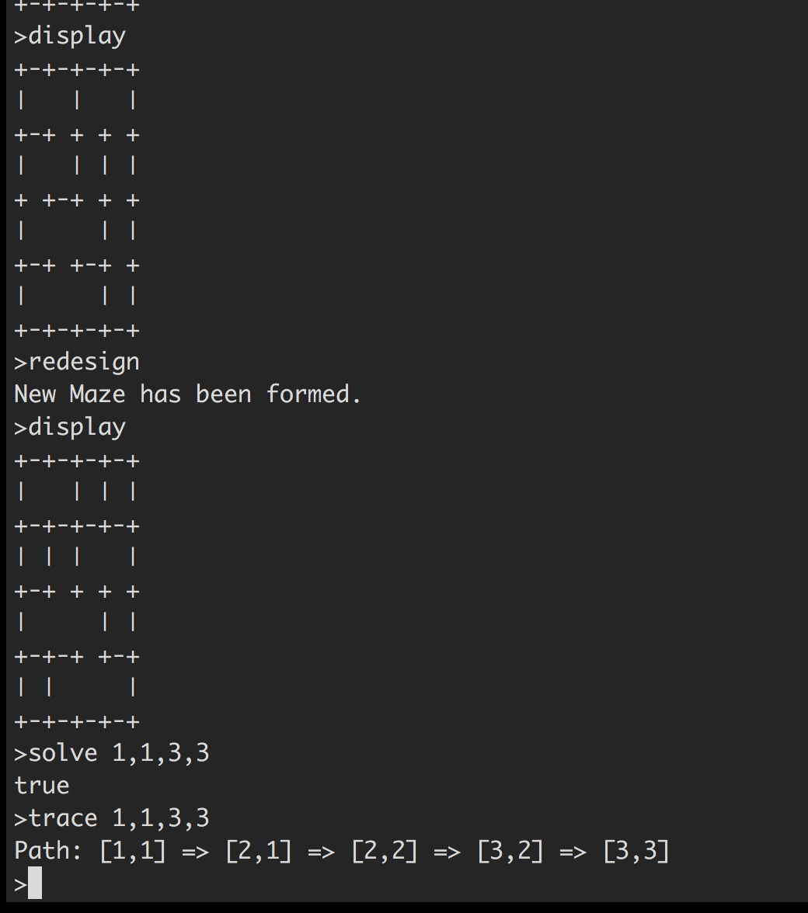

# mazes
=============================

###Description
Mazes:
One of the most basic kinds of games that we can represent in software is a maze. A maze is defined as a rectangular grid (n by m) of cells. Each cell has between 1 and 3 walls. Also, the walls at the outside cells (along the top, left, right and bottom of the maze) are closed. A cell that has 4 walls is a dead end and one that has zero walls of course floats and has no impact.

There's a text-based user interface, just type ``ruby run.rb`` in the directory to start the program.

Test cases are done with Rspec, see ``spec/xx_spec.rb`` 

At the bottom of this page there's a screen shot from the terminal.

###Commands

***exit***

exit program

***redesign***

reset all the cells and walls and come up with a random new maze of the same size. 

***load***

``load(arg)`` load a specific customized maze
you should represent it as a 0-1 string

***display***

prints a diagram of the maze on the console.

***solve***

``solve(begX, begY, endX, endY)`` method that determines if there’s a way to walk from a specified beginning position to a specified ending position. return false if there is now way.

***trace***

``trace(begX, begY, endX, endY)`` method that is just like ``solve()`` but traces the positions that the solution visits.

